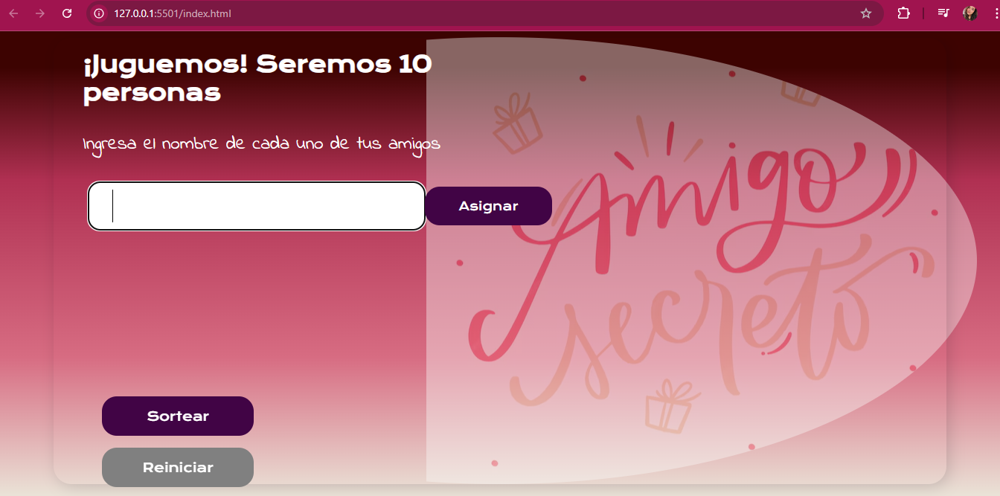
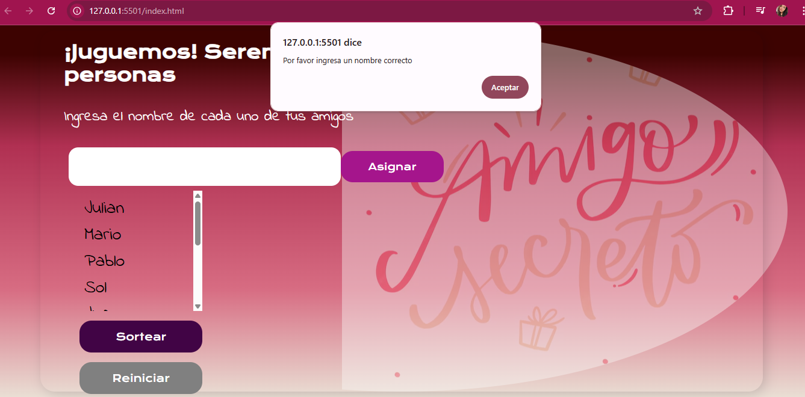
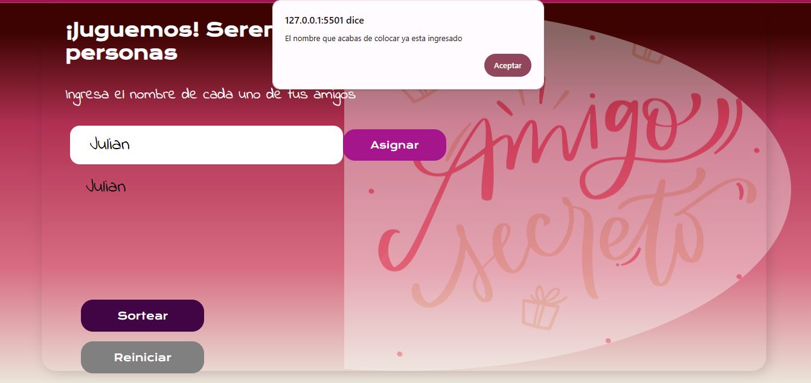
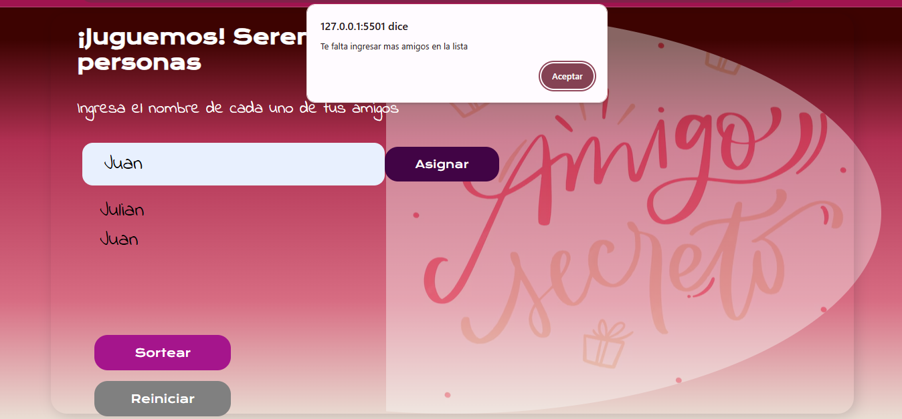
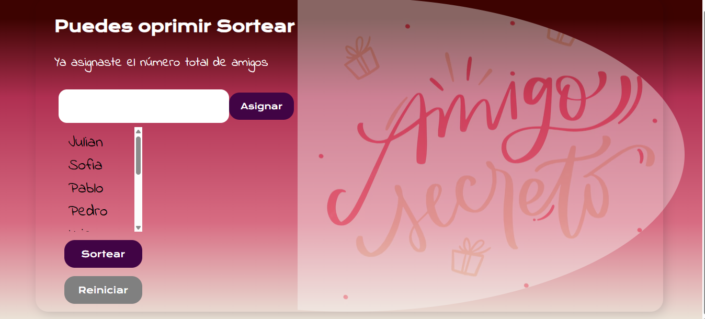
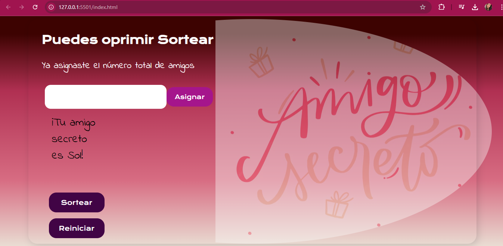

# 🎁 Amigo Secreto - CHALLENGE

Este proyecto es una página web sencilla en HTML, CSS y JavaScript que permite realizar un sorteo aleatorio de 9 nombres para jugar **Amigo Secreto** y que puedas descubrir quien es la persona a la que debes darle un obsequio. Con este juego te vas a divertir y encontraras una manera más facíl para sortear los nombres.

---

## ✨ Funcionalidad.

1. El usuario ingresa un nombre en el campo de texto en blanco y los va asignando en una lista que aparece en la parte de abajo de este campo de texto.
2. La página se encarga de asignar aleatoriamente un nombre, asegurando que ninguno de los nombres ingresados sea repetido y que tampoco se sorteen espacios en blanco.
3. El resultado puede visualizarse en pantalla.

---

## 📸 Capturas de pantalla

### 🖥️ Pantalla principal

> Aquí se muestra el campo de entrada de nombres y el botón para realizar el sorteo.

### 🎲 Error espacios en blanco

> Esta es la vista donde se muestra que se genera un alert cuando se intentan ingresar espacios en blanco.

### 🎲 Repetición amigo

> En esta imagen se puede ver que se genera un error cuando se repite un nombre.

### 🎲 Reinicio juego

> Esta es la vista donde se muestra que el juego se reiniciara si no se ingresan todos los nombres o se oprime el botón sortear.

### 🎲 Momento para oprimir el botón sortear

> Esta es la vista donde se puede oprimir el botón sortear.

### 🎲 Resultado Amigo Secreto

> Esta es la vista donde puedes ver quien fue asignado como tu amigo secreto y se activa el botón reiniciar. 
---

## ⚙️ Tecnologías utilizadas

- HTML5
- CSS3
- JavaScript

---

## 🚀 Creado por Paula Andrea Cruz

